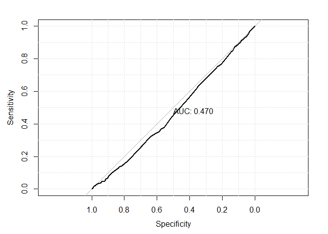
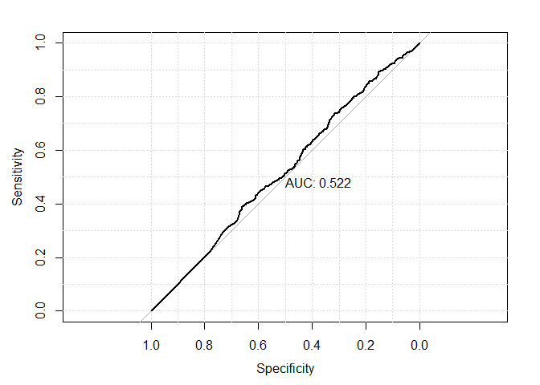
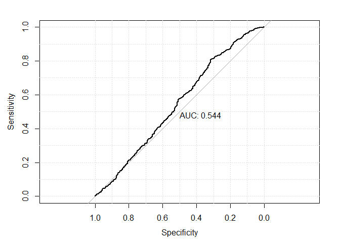

# 05-exercises
Octavio Suarez Munist  
2016-05-xx  

## Reading:
- **APM** Chapter 8.1-8.5 "Regression Trees and Rule-Based Models" (25 pages)
- **APM** Chapter 14.1-14.5 "Classification Trees and Rule-Based"  


```
## 
## Attaching package: 'dplyr'
```

```
## The following objects are masked from 'package:stats':
## 
##     filter, lag
```

```
## The following objects are masked from 'package:base':
## 
##     intersect, setdiff, setequal, union
```

```
## Loading required package: lattice
```

```
## Type 'citation("pROC")' for a citation.
```

```
## 
## Attaching package: 'pROC'
```

```
## The following objects are masked from 'package:stats':
## 
##     cov, smooth, var
```


## Exercise 1: GermanCredit

Revisit the GermanCredit data. Use `caret` to build models of `Class` using the following techniques:

- glm
- rpart
- knn
- party::ctree
- randomForest
- A method of your choice from the Caret Model List (you will need to install any dependencies)

Save the caret objects with the names provided.


```r
# Your work here. 

data(GermanCredit)
gc <- GermanCredit

ctrl <- trainControl( method="boot", number=5, classProb=TRUE, savePrediction=TRUE )

fit.glm <- train(Class ~ Amount, data=gc, method="glm", family="binomial", trControl=ctrl)
fit.knn <- train(Class ~ Amount, data=gc, method="knn", tuneGrid=data.frame( k=c(40,50,60)))
fit.rpart <- train(Class ~ Amount, data=gc, method="rpart",trControl=ctrl, tuneLength=20)
```

```
## Loading required package: rpart
```

```r
fit.rf <- train(Class ~ Amount, data=gc, method="rf",trControl=ctrl)
```

```
## Loading required package: randomForest
```

```
## Warning: package 'randomForest' was built under R version 3.2.5
```

```
## randomForest 4.6-12
```

```
## Type rfNews() to see new features/changes/bug fixes.
```

```
## 
## Attaching package: 'randomForest'
```

```
## The following object is masked from 'package:dplyr':
## 
##     combine
```

```
## The following object is masked from 'package:ggplot2':
## 
##     margin
```

```
## Warning in randomForest.default(x, y, mtry = param$mtry, ...): invalid
## mtry: reset to within valid range
```

```
## Warning in randomForest.default(x, y, mtry = param$mtry, ...): invalid
## mtry: reset to within valid range

## Warning in randomForest.default(x, y, mtry = param$mtry, ...): invalid
## mtry: reset to within valid range

## Warning in randomForest.default(x, y, mtry = param$mtry, ...): invalid
## mtry: reset to within valid range

## Warning in randomForest.default(x, y, mtry = param$mtry, ...): invalid
## mtry: reset to within valid range

## Warning in randomForest.default(x, y, mtry = param$mtry, ...): invalid
## mtry: reset to within valid range
```

```r
fit.myown <- train(Class ~ Amount, data=gc, method="bayesglm",trControl=ctrl)
```

```
## Loading required package: arm
```

```
## Warning: package 'arm' was built under R version 3.2.5
```

```
## Loading required package: MASS
```

```
## 
## Attaching package: 'MASS'
```

```
## The following object is masked from 'package:dplyr':
## 
##     select
```

```
## Loading required package: Matrix
```

```
## Loading required package: lme4
```

```
## 
## arm (Version 1.8-6, built: 2015-7-7)
```

```
## Working directory is C:/Users/OMunist/Desktop/CSX460/CSX460osm/05-decision-trees
```


- Compare the models using `caret::confusionMatrix`
- Comparing the models Using the `pROC` packages
  - create ROC curves for the models 
  
Show your work! 

NOTE: Not sure why KNN is failing; removing from analysis for now.


```r
table(fit.glm$pred$pred, fit.glm$pred$obs) %>% confusionMatrix()
```

```
## Confusion Matrix and Statistics
## 
##       
##         Bad Good
##   Bad    25   12
##   Good  542 1262
##                                         
##                Accuracy : 0.6991        
##                  95% CI : (0.6775, 0.72)
##     No Information Rate : 0.692         
##     P-Value [Acc > NIR] : 0.2646        
##                                         
##                   Kappa : 0.0468        
##  Mcnemar's Test P-Value : <2e-16        
##                                         
##             Sensitivity : 0.04409       
##             Specificity : 0.99058       
##          Pos Pred Value : 0.67568       
##          Neg Pred Value : 0.69956       
##              Prevalence : 0.30798       
##          Detection Rate : 0.01358       
##    Detection Prevalence : 0.02010       
##       Balanced Accuracy : 0.51734       
##                                         
##        'Positive' Class : Bad           
## 
```

```r
#table(fit.knn$pred$pred, fit.knn$pred$obs) %>% confusionMatrix()
table(fit.rpart$pred$pred, fit.rpart$pred$obs) %>% confusionMatrix()
```

```
## Confusion Matrix and Statistics
## 
##       
##          Bad  Good
##   Bad   1857  2673
##   Good  9063 23507
##                                           
##                Accuracy : 0.6837          
##                  95% CI : (0.6789, 0.6884)
##     No Information Rate : 0.7057          
##     P-Value [Acc > NIR] : 1               
##                                           
##                   Kappa : 0.0819          
##  Mcnemar's Test P-Value : <2e-16          
##                                           
##             Sensitivity : 0.17005         
##             Specificity : 0.89790         
##          Pos Pred Value : 0.40993         
##          Neg Pred Value : 0.72174         
##              Prevalence : 0.29434         
##          Detection Rate : 0.05005         
##    Detection Prevalence : 0.12210         
##       Balanced Accuracy : 0.53398         
##                                           
##        'Positive' Class : Bad             
## 
```

```r
table(fit.rf$pred$pred, fit.rf$pred$obs) %>% confusionMatrix()
```

```
## Confusion Matrix and Statistics
## 
##       
##        Bad Good
##   Bad  159  319
##   Good 405  953
##                                           
##                Accuracy : 0.6057          
##                  95% CI : (0.5829, 0.6281)
##     No Information Rate : 0.6928          
##     P-Value [Acc > NIR] : 1.000000        
##                                           
##                   Kappa : 0.0325          
##  Mcnemar's Test P-Value : 0.001583        
##                                           
##             Sensitivity : 0.2819          
##             Specificity : 0.7492          
##          Pos Pred Value : 0.3326          
##          Neg Pred Value : 0.7018          
##              Prevalence : 0.3072          
##          Detection Rate : 0.0866          
##    Detection Prevalence : 0.2603          
##       Balanced Accuracy : 0.5156          
##                                           
##        'Positive' Class : Bad             
## 
```

```r
table(fit.myown$pred$pred, fit.myown$pred$obs) %>% confusionMatrix()
```

```
## Confusion Matrix and Statistics
## 
##       
##         Bad Good
##   Bad    28   14
##   Good  550 1230
##                                           
##                Accuracy : 0.6905          
##                  95% CI : (0.6687, 0.7116)
##     No Information Rate : 0.6828          
##     P-Value [Acc > NIR] : 0.2489          
##                                           
##                   Kappa : 0.0495          
##  Mcnemar's Test P-Value : <2e-16          
##                                           
##             Sensitivity : 0.04844         
##             Specificity : 0.98875         
##          Pos Pred Value : 0.66667         
##          Neg Pred Value : 0.69101         
##              Prevalence : 0.31723         
##          Detection Rate : 0.01537         
##    Detection Prevalence : 0.02305         
##       Balanced Accuracy : 0.51859         
##                                           
##        'Positive' Class : Bad             
## 
```

```r
roc(fit.glm$pred$obs, fit.glm$pred$Bad, auc=TRUE )  %>% plot( print.auc=TRUE, grid=TRUE)
```


```
## 
## Call:
## roc.default(response = fit.glm$pred$obs, predictor = fit.glm$pred$Bad,     auc = TRUE)
## 
## Data: fit.glm$pred$Bad in 567 controls (fit.glm$pred$obs Bad) > 1274 cases (fit.glm$pred$obs Good).
## Area under the curve: 0.5488
```

```r
#roc(fit.knn$pred$obs, fit.knn$pred$Bad, auc=TRUE )  %>% plot( print.auc=TRUE, grid=TRUE)
roc(fit.rpart$pred$obs, fit.rpart$pred$Bad, auc=TRUE )  %>% plot( print.auc=TRUE, grid=TRUE)
```



```
## 
## Call:
## roc.default(response = fit.rpart$pred$obs, predictor = fit.rpart$pred$Bad,     auc = TRUE)
## 
## Data: fit.rpart$pred$Bad in 10920 controls (fit.rpart$pred$obs Bad) > 26180 cases (fit.rpart$pred$obs Good).
## Area under the curve: 0.5433
```

```r
roc(fit.rf$pred$obs, fit.rf$pred$Bad, auc=TRUE )  %>% plot( print.auc=TRUE, grid=TRUE)
```



```
## 
## Call:
## roc.default(response = fit.rf$pred$obs, predictor = fit.rf$pred$Bad,     auc = TRUE)
## 
## Data: fit.rf$pred$Bad in 564 controls (fit.rf$pred$obs Bad) < 1272 cases (fit.rf$pred$obs Good).
## Area under the curve: 0.4897
```

```r
roc(fit.myown$pred$obs, fit.myown$pred$Bad, auc=TRUE )  %>% plot( print.auc=TRUE, grid=TRUE)
```



```
## 
## Call:
## roc.default(response = fit.myown$pred$obs, predictor = fit.myown$pred$Bad,     auc = TRUE)
## 
## Data: fit.myown$pred$Bad in 578 controls (fit.myown$pred$obs Bad) > 1244 cases (fit.myown$pred$obs Good).
## Area under the curve: 0.5606
```


Q: Which models would you select based on these tools?

A: base on AUC, GLM is the best, with also the second-best Accuracy, but sensitivity is the worse of a bad lot. 

Q: If you assume that a `Class=="bad""` is 10 more costly than `Class=="good"`, determine your threshold for the model of your choice.  

A: First thought would be to lower threshold by a factor of 10, to 0.05. But maybe adjust for proportion of bad.


